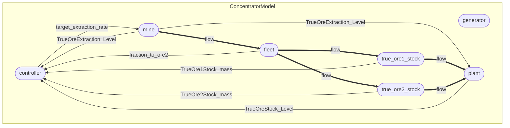

# DRS Module Graph — ConcentratorModel

> Generated automatically by `drs.vis.module_graph.save_module_graph_report`

## Module Hierarchy

| Name | Path | Variables |
|------|------|-----------|
| `ConcentratorModel` | `(root)` | `global_time` |
| `generator` | `generator` | `—` |
| `mine` | `mine` | `true_current_parcel_mass, true_ore_extraction, true_ore_extracted_from_current_parcel, true_current_parcel_grade` |
| `fleet` | `fleet` | `fraction_to_ore2` |
| `true_ore1_stock` | `true_ore1_stock` | `mass, actual_outflow, grade` |
| `true_ore2_stock` | `true_ore2_stock` | `mass, actual_outflow, grade` |
| `plant` | `plant` | `true_ore_stock, true_total_ore_milled` |
| `controller` | `controller` | `current_mode, time_executed_campaign_shutdown, time_executed_contingency, time_mode_a, time_mode_a_contingency, +8 more` |

## Flowchart

## Data Dependencies (persistent variable reads)

The following read-dependencies were recorded during the simulation. An arrow `A → B` means module B reads a variable owned by module A.

  - `controller` → `ConcentratorModel` reads `target_ore1_mill_rate`
  - `controller` → `ConcentratorModel` reads `target_ore2_mill_rate`
  - `controller` → `mine` reads `target_extraction_rate`
  - `mine` → `plant` reads `TrueOreExtraction_Level`
  - `mine` → `controller` reads `TrueOreExtraction_Level`
  - `true_ore1_stock` → `controller` reads `TrueOre1Stock_mass`
  - `true_ore2_stock` → `controller` reads `TrueOre2Stock_mass`
  - `plant` → `controller` reads `TrueOreStock_Level`
  - `fleet` → `controller` reads `fraction_to_ore2`

## Data Flow (transient)

The following transient flow-edges were recorded during the simulation. An arrow `A → B` means module A returned a `drs.Flow` value that was passed as input to module B.

  - `mine` → `fleet` flow
  - `fleet` → `true_ore1_stock` flow
  - `fleet` → `true_ore2_stock` flow
  - `true_ore1_stock` → `plant` flow
  - `true_ore2_stock` → `plant` flow

## Visual Graph

