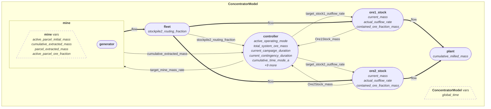

# DRS Module Graph — ConcentratorModel

> Generated automatically by `drs.vis.module_graph.save_module_graph_report`

## Module Hierarchy

| Name | Path | Variables |
|------|------|-----------|
| `ConcentratorModel` | `(root)` | `global_time` |
| `mine` | `mine` | `active_parcel_initial_mass, cumulative_extracted_mass, parcel_extracted_mass, active_parcel_ore_fraction` |
| `generator` | `mine.generator` | `—` |
| `fleet` | `fleet` | `stockpile2_routing_fraction` |
| `ore1_stock` | `ore1_stock` | `current_mass, actual_outflow_rate, contained_ore_fraction_mass` |
| `ore2_stock` | `ore2_stock` | `current_mass, actual_outflow_rate, contained_ore_fraction_mass` |
| `plant` | `plant` | `cumulative_milled_mass` |
| `controller` | `controller` | `active_operating_mode, total_system_ore_mass, current_campaign_duration, current_contingency_duration, cumulative_time_mode_a, +9 more` |

## Flowchart

## Data Dependencies (persistent variable reads)

The following read-dependencies were recorded during the simulation. An arrow `A → B` means module B reads a variable owned by module A.

  - `controller` → `mine` reads `target_mine_mass_rate`
  - `controller` → `ore1_stock` reads `target_stock1_outflow_rate`
  - `controller` → `ore2_stock` reads `target_stock2_outflow_rate`
  - `mine` → `controller` reads `cumulative_extracted_mass`
  - `ore1_stock` → `controller` reads `Ore1Stock_mass`
  - `ore2_stock` → `controller` reads `Ore2Stock_mass`
  - `fleet` → `controller` reads `stockpile2_routing_fraction`

## Data Flow (transient)

The following transient flow-edges were recorded during the simulation. An arrow `A → B` means module A returned a `drs.Flow` value that was passed as input to module B.

  - `mine` → `fleet` flow
  - `fleet` → `ore1_stock` flow
  - `fleet` → `ore2_stock` flow
  - `ore1_stock` → `plant` flow
  - `ore2_stock` → `plant` flow

## Visual Graph

