# DRS Module Graph — ActiveFleetConcentratorModel

> Generated automatically by `drs.vis.module_graph.save_module_graph_report`

## Module Hierarchy

| Name | Path | Variables |
|------|------|-----------|
| `ActiveFleetConcentratorModel` | `(root)` | `global_time` |
| `face1` | `face1` | `active_parcel_initial_mass, cumulative_extracted_mass, parcel_extracted_mass, active_parcel_ore_fraction` |
| `generator` | `face1.generator` | `—` |
| `face2` | `face2` | `active_parcel_initial_mass, cumulative_extracted_mass, parcel_extracted_mass, active_parcel_ore_fraction` |
| `generator` | `face2.generator` | `—` |
| `fleet` | `fleet` | `stockpile2_routing_fraction` |
| `ore1_stock` | `ore1_stock` | `current_mass, actual_outflow_rate, contained_ore_fraction_mass` |
| `ore2_stock` | `ore2_stock` | `current_mass, actual_outflow_rate, contained_ore_fraction_mass` |
| `plant` | `plant` | `cumulative_milled_mass` |
| `controller` | `controller` | `active_operating_mode, total_system_ore_mass, current_campaign_duration, current_contingency_duration, cumulative_time_mode_a, +11 more` |

## Flowchart

```mermaid
flowchart TD
subgraph root["<b>ActiveFleetConcentratorModel</b>"]
    root_vars[/"<b>ActiveFleetConcentratorModel</b> vars<br><i>global_time</i>"\]
    style root_vars fill:transparent,stroke-dasharray: 5 5
    subgraph face1["<b>face1</b>"]
        face1_vars[/"<b>face1</b> vars<br><i>active_parcel_initial_mass</i><br><i>cumulative_extracted_mass</i><br><i>parcel_extracted_mass</i><br><i>active_parcel_ore_fraction</i>"\]
        style face1_vars fill:transparent,stroke-dasharray: 5 5
        face1_generator(["<b>generator</b>"])
    end
    subgraph face2["<b>face2</b>"]
        face2_vars[/"<b>face2</b> vars<br><i>active_parcel_initial_mass</i><br><i>cumulative_extracted_mass</i><br><i>parcel_extracted_mass</i><br><i>active_parcel_ore_fraction</i>"\]
        style face2_vars fill:transparent,stroke-dasharray: 5 5
        face2_generator(["<b>generator</b>"])
    end
    fleet(["<b>fleet</b><br><i>stockpile2_routing_fraction</i>"])
    ore1_stock(["<b>ore1_stock</b><br><i>current_mass</i><br><i>actual_outflow_rate</i><br><i>contained_ore_fraction_mass</i>"])
    ore2_stock(["<b>ore2_stock</b><br><i>current_mass</i><br><i>actual_outflow_rate</i><br><i>contained_ore_fraction_mass</i>"])
    plant(["<b>plant</b><br><i>cumulative_milled_mass</i>"])
    controller(["<b>controller</b><br><i>active_operating_mode</i><br><i>total_system_ore_mass</i><br><i>current_campaign_duration</i><br><i>current_contingency_duration</i><br><i>cumulative_time_mode_a</i><br><i>+11 more</i>"])
end
    controller -->|face0_rate| face1
    controller -->|face1_rate| face2
    controller -->|target_stock1_outflow_rate| ore1_stock
    controller -->|target_stock2_outflow_rate| ore2_stock
    face1 -->|cumulative_extracted_mass| controller
    face2 -->|cumulative_extracted_mass| controller
    ore1_stock -->|Ore1Stock_mass| controller
    ore2_stock -->|Ore2Stock_mass| controller
    fleet -->|stockpile2_routing_fraction| controller
    face1 ==>|flow| fleet
    face2 ==>|flow| fleet
    fleet ==>|flow| ore1_stock
    fleet ==>|flow| ore2_stock
    ore1_stock ==>|flow| plant
    ore2_stock ==>|flow| plant
```

## Data Dependencies (persistent variable reads)

The following read-dependencies were recorded during the simulation. An arrow `A → B` means module B reads a variable owned by module A.

  - `ore1_stock` → `ActiveFleetConcentratorModel` reads `Ore1Stock_mass`
  - `ore2_stock` → `ActiveFleetConcentratorModel` reads `Ore2Stock_mass`
  - `controller` → `ActiveFleetConcentratorModel` reads `total_system_ore_mass`
  - `controller` → `face1` reads `face0_rate`
  - `controller` → `face2` reads `face1_rate`
  - `controller` → `ore1_stock` reads `target_stock1_outflow_rate`
  - `controller` → `ore2_stock` reads `target_stock2_outflow_rate`
  - `face1` → `controller` reads `cumulative_extracted_mass`
  - `face2` → `controller` reads `cumulative_extracted_mass`
  - `ore1_stock` → `controller` reads `Ore1Stock_mass`
  - `ore2_stock` → `controller` reads `Ore2Stock_mass`
  - `fleet` → `controller` reads `stockpile2_routing_fraction`

## Data Flow (transient)

The following transient flow-edges were recorded during the simulation. An arrow `A → B` means module A returned a `drs.Flow` value that was passed as input to module B.

  - `face1` → `fleet` flow
  - `face2` → `fleet` flow
  - `fleet` → `ore1_stock` flow
  - `fleet` → `ore2_stock` flow
  - `ore1_stock` → `plant` flow
  - `ore2_stock` → `plant` flow

## Visual Graph

