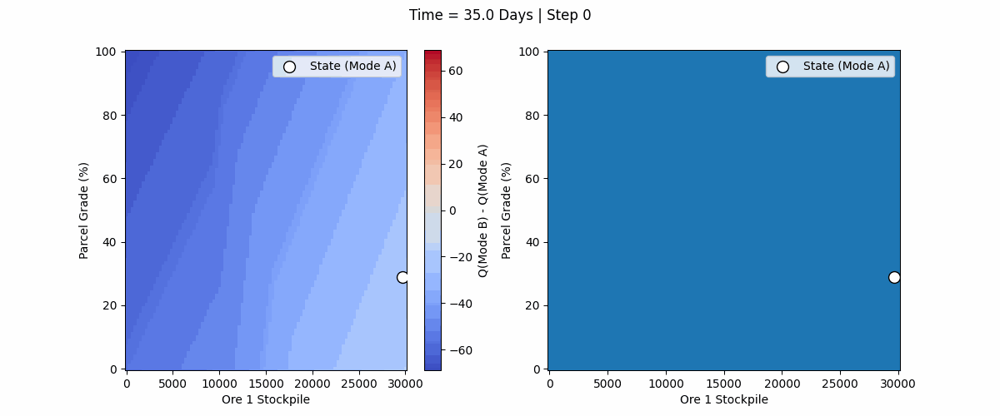
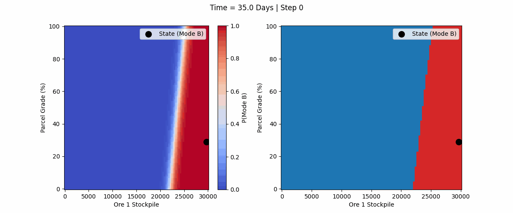
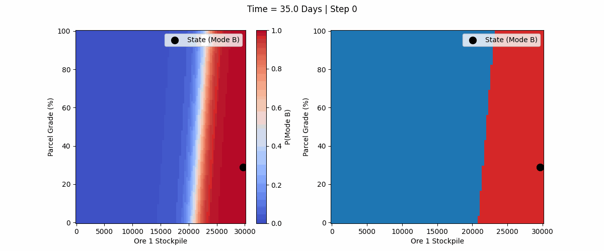
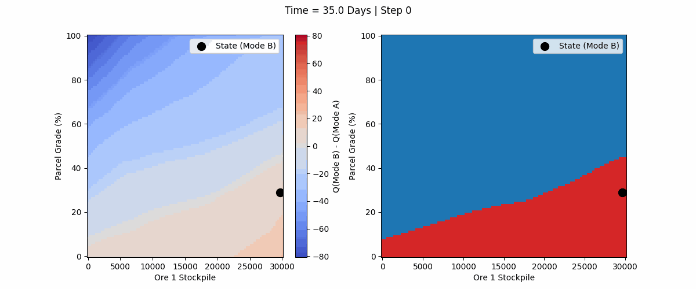

All the RL models seem to outperform the results in [2019_NavarraRojasAlvarezMenziesPaxWaters_ConcentratorOperationalModes.pdf](../../../../../papers/2019_NavarraRojasAlvarezMenziesPaxWaters_ConcentratorOperationalModes.pdf) by taking either the current time into account or by taking the grade of the current parcel into account. 

We do not recreate the results of [2019_NavarraRojasAlvarezMenziesPaxWaters_ConcentratorOperationalModes.pdf](../../../../../papers/2019_NavarraRojasAlvarezMenziesPaxWaters_ConcentratorOperationalModes.pdf) on the 30k total stockpile case with 2.5 std. However in the paper they achieved a throughput of ~5,494 t/d on this scenario with these values. It should be noted there was an error in there methodology where a new parcel was always generated. We use the same DRS as they did, except that our DRS correctly only generates a new parcel 30% of the time (i think its 30% but may be 70%). They tested results accross a wider range of stockpile levels and variances. We aim to show that the RL can perform better than OptQuest that was used for the paper (on at least one case for the sake of time). We achieve better results, with all models getting an average throughput above 5,630 t/d on 100 trials. Not all plots are directly comparible with the paper, however we attempted to use similar plots. 

> [!TODO] does the naive method require knowledge about the underlying distribution (in the Navarra paper?) if so another benefit of RL though OptQuest also does not require this info. 
> also can the current parcel grade be easily known for each parcel?

The Q learning based methods seem to take time into account more as well as the grade of the current parcel. And their policies are more complex. DQN is the major culprit of this, Rainbow exhibits a little bit of this behaviour. 

PPO based methods seem to learn a simple linear threshold based on both the current stockpile levels and the grade of the current parcel. 

Taking time into account is probably cheating as the mine should be considered a continual problem without a termination condition. DQN and Rainbow DQN seem to kind of cheat, taking advantage of the perfect start position and the fact that the end of the simulation is known to occur. 

PPO doesn't do this though and outperforms OptQuest (though does worse than DQN and Rainbow DQN). 

Adding an LSTM to PPO seems to improve results slightly. It's not 100% clear why as there isn't really any hidden state information. Its likely just training noise leading to slightly less variance in the results of the LSTM policy compared to standard PPO, but maybe it is storing some kind of intent or it may just be noise in the training of PPO as the shape of the learned policies appear to be very similar.

It's unclear why DQN learns a more complex policy. It may be because of the networks used or the dense reward function, or perhaps something inherent to DQN and the fact that actions are selected by value and argmax. It should be noted that although the policies were very different in seeds looked at Rainbow DQN and PPO performed the exact same, so its possible the difference really only exists at rare fringe states. Rainbow had some time dependent changes, though in general it was a linear line that only shifted slightly unlike the DQN policy which shifted greatly as time progressed in both shape and translation. This may indicate that DQN struggled to learn a good policy based on the stockpiles and so "cheated" using the time instead. Rainbow DQN did not seem to do this.  

It's also important to note that DQN needed a dense reward function to perform well (as did Rainbow DQN). Without it the agent basically just only selected mode A or mode B. Or it would select Mode A at the start and then Mode B at the end. This was because if two states were very similar but one happened at the start and the other at the end (without the time component to state) then the Q values would be different and the agent would end up averaging. Making it time aware in the observations made DQN learn to pick A at the start and then B at the end. But it didnt really seem to adjust to the stockpiles. 

PPO improved by making it time aware though performed well with or without it. (TODO I think PPO with LSTM suffered without time in the observation, but I didn't save the data for that and would need to check again). It performed better though with time in the observation, though its policy almost completely ignored time. It performed better than OptQuest with or without being time aware. The policies learned by PPO and PPO with an LSTM using time aware observations were essentially the exact same. 

Something really interesting is that although PPO and Rainbow both perform better than OptQuest, and both take into account the current parcel grade and the stockpile levels, Rainbow pays much more attention to grade levels. In the policy maps the decision boundaries are almost perpendicular (not really but essentially ppo has a very steep slope and high x-intercept and the rainbow a very shallow slope and low x intercept). In other words, Rainbow changes its decision if the grade of Ore 1 in the current parcel is high enough (higher than ~40), opting to select mode A ignoring stockpile level completely, where as for PPO the grade only affects the decision of the Mode slightly, meaning that it may opt for mode B even if the grade of the current parcel is very high. This may be an artifact of the reward function as that is a major difference between the two, or it could be several other causes. 

Future work could be to have the agent set the threshold values at the start of the mine and have those thresholds (for stockpiles) be fixed (not adjust to the current parcel). This would likely lead to the same or very similar results as OptQuest and doesn't take advantage of the live state of the mine and ore parcel available when deciding the operating mode. This might be interesting if the goal were to use RL to get the same output as OptQuest but with a different method. Another simple thing would be to test DRQN (but results would likely show similar impact as PPO+LSTM showed compared to PPO). Other future work might be extending to the continual case where the agent learns from a single seed and there is no termination. This may involve things like CBP and average reward. Additionally, extending to the non-stationary case for changing geostatistics could be useful using methods based on IDBD (as well as CBP). It may be interesting to extend the problem to include some kind of hidden information to make the problem more realistic, and perhaps this hidden information may benefit from being tracked by an LSTM, though this may be unecessary and just be something that would highlight the benefits of adding an LSTM. This however may link to the non-stationary case, as for example the LSTM may be able to track the mean grade of the ore as it changes. Another improvement would be stream RL or True Online Learning. These could likely be done together. They may require using simpler algorithms like A2C for the stream case, or even linear value functions etc, but would be more applicable to the "real world" scenario which is a non-episodic (continual), non-stationary, stream decision making problem. It may also be important to better understand what is causing the differing shapes of the algorithms policies as stream RL as yet does not have a PPO stream RL implementation and so may lead to the uglier, more complex, policies. However, although there is more work to be done to understand why the different algorithms learn the different methods that they learn and if there are ways of preventing DQN from learning an overly complex, impractical policy, and why Rainbow and PPO learn different but both effective policies, this is not the point of the experiment. The point of the experiment is to show that RL methods can be useful for operational mode control, specifically in the mining stockpile scenario. They can outperform OptQuest and discover various novel strategies that take advantage of the stochasticity in the problem in ways that heuristic optimization methods like OptQuest fail to do, and they can adjust to the current state of the mine when deciding the operating mode, instead of being statically set at the start of the experiment/mine. 
## Plots and Visualizations

### Comprehensive Diagnostics

### Monte Carlo Throughput (Fig 5)

### Non-Stationary Time Slices

### Policy Decision Heatmaps

### Policy Decision Videos

--- 

> [!TODO]
> list of things that may improve the report.
> Plot the policy space of DQN and Rainbow DQN without time aware and without the dense reward function. 
> Do an ablation on these for DQN and Rainbow
> Test PPO with the dense reward function
> Test DQN with PPO architecture to see if DQN learns a nice simple effective policy like PPO
> Pareto Frontier Plot

Early in the process I had this question: Why does PPO learn a better policy with lower variance (and the low variance policy transfers to high variance better too)? Somehow this issue was resolved though I'm not sure what resolved it. 

These were my early notes and my hypothesis for using the RL approach: 
> Why Stream RL for 2 Ore Milling: 
> Opt quest requires many Monte Carlo trajectories to optimize. If the geostats change new trajectories must be computed 
> Opt quest gives an approximate best value, again based on mc samples which are also appoximate
> (stream) rl can learn online, so it would not require rerunning optquest 
> (stream) rl uses historical data. (does optquest sort of too?) 
> rl allows for more techniques 
> rl can be less black box than opt quest 
> true online stream rl can work without generating “parallel” mc simulations like opt quest (ie one single stream of experience) 
> its also possible to learn offline from current system
> rl may require less info on geo stats etc and entire system while maintaining whole system benefit via reward function
> thesis for improving on 2019 
> RL may be able to account for things like fixed parcel rates and understand how to adapt to the current parcel (do parcels even last long enough for that to matter?). given enough granularity it could possibly do better. 
> could rl do better with the stochasticicty? with the risk aversion? what human info can we remove as inputs from the system
> so benefits are
> 1. constantly adapting (non stationary) 
> 2. less blackbox 
> 3. single stream, no simulators or mc samples 
> 4. offline learning
> 5. more room for improvement 
> 6. possibly less inputs
> 7. possibly a better algorithm 
> another simpler way of seeing it is maybe that RL can be a function approximation of the formula in the paper
