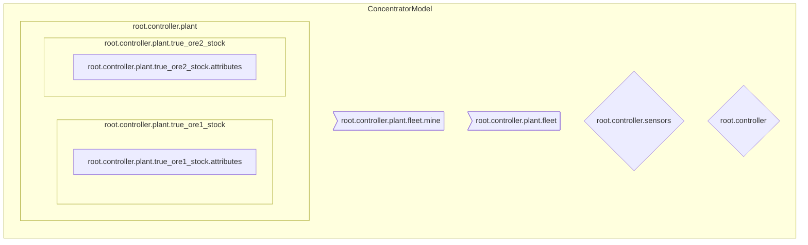

# System Topology Diagram

```mermaid
graph LR
    subgraph ConcentratorModel [ConcentratorModel]
        root_controller_plant_fleet_mine>"root.controller.plant.fleet.mine"]
        root_controller_plant_fleet>"root.controller.plant.fleet"]
        subgraph root_controller_plant [root.controller.plant]
            subgraph root_controller_plant_true_ore1_stock [root.controller.plant.true_ore1_stock]
                root_controller_plant_true_ore1_stock_attributes["root.controller.plant.true_ore1_stock.attributes"]
            end
            subgraph root_controller_plant_true_ore2_stock [root.controller.plant.true_ore2_stock]
                root_controller_plant_true_ore2_stock_attributes["root.controller.plant.true_ore2_stock.attributes"]
            end
        end
        root_controller_sensors{"root.controller.sensors"}
        root_controller{"root.controller"}
    end

```